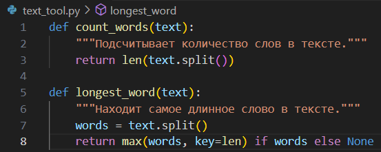
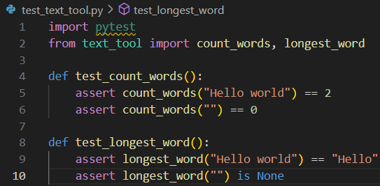
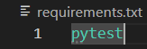

# 4 lab

# Выполнил Квасков Владислав ИС-22

## Задача 1

1. Настроил `docker-compose.yaml` для сервисов:
   - **Jenkins**  
   - **GitLab**  
   - **SonarQube (с PostgreSQL)**  
   - **Nexus**  

2. Поднял все сервисы через `docker-compose up -d`. 
3. Протестировал их доступность

#  [docker-compose](https://github.com/Vlkezz/LAB-4/blob/main/docker-compose.yaml)

# Скриншоты работающих сервисов
## Jenkins

## GitLab

## SonarQube

## Nexus

## Задача 2
1. Создал файл `text_tool.py`

2. Написал модульные тесты в файле `test_text_tool.py`

3. Создал файл `requirements.txt` с зависимостями

